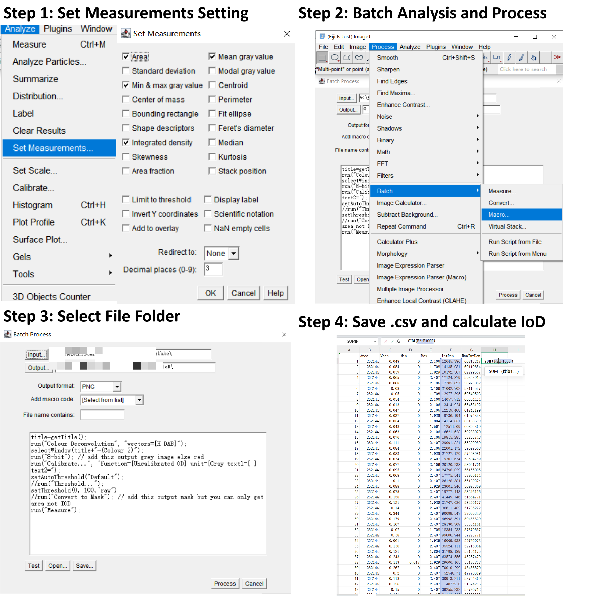

# How To Calculate IoD and Pearson-R

## Calculate IoD (Optical Density) with Fiji Step

Step 1 : Click Analysis -> Set Measurments -> tick Area, Mean gray value, Integrated density(**Import**) -> Ok

Step2: Click Process -> Batch -> Marco -> add code as follow:

```
title=getTitle();
run("Colour Deconvolution", "vectors=[H DAB]");
selectWindow(title+"-(Colour_2)");
run("8-bit"); // add this output grey image else red
run("Calibrate...", "function=[Uncalibrated OD] unit=[Gray text1=[ ] text2=");
setAutoThreshold("Default");
//run("Threshold...");
setThreshold(0, 100,"raw");
//run("Convert to Mask"); // add this output mask but you can only get area not IOD
run("Measure");

```
 
Step3: Select generate file folder, output file is gray scale image, create file folder to store.

Step4: Save As csv and calculate =SUM(F2:F1000), the results is the sum of optical density. (If you want to calculate IoD,You need to calculate groundturth file folder in test dataset). 



## Calculate Pearson-R

you need to change this python file to your .xlxs path.

```
python scripts/pearson_R.py
```